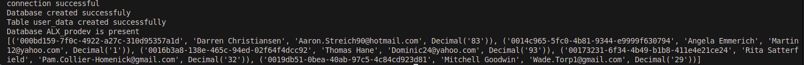
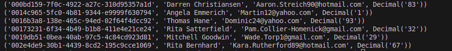

## Python Generators
Python script [seed.py >>](./seed.py)
- Set up the MySQL database, ALX_prodev with the table user_data with the following fields:
`user_id(Primary Key, UUID, Indexed)`
`name (VARCHAR, NOT NULL)`
`email (VARCHAR, NOT NULL)`
`age (DECIMAL,NOT NULL)`
- Populate the database with the sample data from this user_data.csv
  - Prototypes:
- `def connect_db()` :- connects to the mysql database server
- `def create_database(connection)`:- creates the database ALX_prodev if it does not exist
- `def connect_to_prodev()` connects the the ALX_prodev database in MYSQL
- `def create_table(connection)`:- creates a table user_data if it does not exists with the required fields
- `def insert_data(connection, data)`:- inserts data in the database if it does not exist

## seed.py module has these functions:
- `db_connection()` — connects to MySQL without specifying a database.

- `create_database(conn)` — creates the ALX_prodev database.

- `connect_to_prodev()` — connects specifically to the ALX_prodev DB.

- `create_table(conn)` — creates user_data table inside ALX_prodev.

- `insert_data(conn, 'user_data.csv')` — inserts records into user_data.

## Screenshot


## A generator that streams rows from an SQL database

write a function that uses a generator to fetch rows one by one from the user_data table

```SQL
  
def stream_users():
    ''' Returns user after user using a generator '''

    connection = mysql.connector.connect(
        host="localhost",
        user="root",
        password="",
        database="ALX_prodev"
    )
    cursor = connection.cursor()
    cursor.execute("SELECT * FROM user_data")

    while True:
        row = cursor.fetchone()
        if row is None:
            break
        yield row

    cursor.close()
    connection.close()
```

## Screenshot


## Batch processing Large Data
A generator to fetch and process data in batches from the `user_data` table [Batch processing generator >>](./1-batch_processing.py)

## Lazy loading Paginated Data
[Lazy pagination >>](./2-lazy_paginate.py) Implements a generator function lazypaginate(pagesize) that implements the `paginate_users(page_size, offset)` that will only fetch the next page when needed at an offset of `0`.

